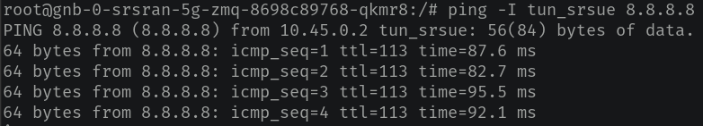

# Open5GS Core Network

## Requirements

- Kubernetes (tested with 1.28)
- Helm v3

## Getting Started

### Open5GS Deployment with 3 slices (eMBB + URLLC + MIoT)

Clone the repository

```sh
cd ~
git clone https://github.com/gercom-ufpa/open5gs.git
```

Install the core network with Helm

```sh
helm upgrade --install open5gs -n open5gs --create-namespace oci://registry-1.docker.io/gradiant/open5gs --version 2.2.2 -f ~/open5gs/values/open5gs/open5gs_with_slices.yaml
```

> **_NOTE_**: [open5gs_with_slices.yaml](./values/open5gs/open5gs_with_slices.yaml) example file.

> **_NOTE_**: nodeSelector is `kubernetes.io/hostname: open5gslocal`, change it if necessary.

The Open5GS GUI will be available at http://[open5gs-node-IP]:30999
- user: admin
- password: 1423

### SRS-RAN Deployment

Clone the grandiant/5g-charts repository

```sh
cd ~
git clone https://github.com/Gradiant/5g-charts.git
```

Install SRS-RAN with custom file (gNB + 1 UE)

```sh
cd 5g-charts/charts/srsran-5g-zmq
helm dependency build
helm upgrade --install gnb-0 -n srsran --create-namespace . -f ~/open5gs/values/srsran/srsran_zmq.yaml
```

> **_NOTE_**: nodeSelector is `kubernetes.io/hostname: oranstacklocal`, change it if necessary.

Test UE connectivity

```sh
kubectl exec -it -n srsran gnb-0-srsran-5g-zmq-<POD-ID> -c gnb-0-srsran-5g-zmq-ue -- bash
ping -I tun_srsue 8.8.8.8
```

The following result should appear.



## Clean up

```sh
helm uninstall -n open5gs open5gs && kubectl delete ns open5gs
helm uninstall -n srsran gnb-0 && kubectl delete ns srsran
```